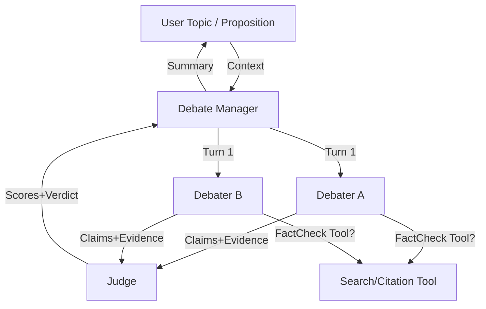

# AGORA — AI Debate Club (Freestyle)

> **One‑liner:** An AI debate club where two agents argue both sides and a judge agent scores logic, facts, and persuasion.

**Track:** Freestyle  
**Last Updated:** 2025-11-15

## 🧭 Problem & Why Agents
- **Problem:** Online debates are noisy and low‑signal. We want a controlled forum where arguments are clear, evidence‑backed, and judged fairly.
- **Why agents:** Multi‑agent roles (two debaters + a judge) enable structure, turn‑taking, and transparent critique—something a single LLM can’t enforce by itself.

## 🏗️ Architecture (High‑level)
- **Agents:** Debater A, Debater B, Judge
- **Pattern:** Sequential rounds with optional rebuttal loops
- **Tools:** Optional fact‑check tool (web search/OpenAPI), citation extractor
- **Memory:** Round transcript + claim index per side
- **Observability:** Logs of claims, citations, scores
- **Evaluation:** Judge rubric (logic, facts, persuasion)

> Mermaid sketch (save as `docs/architecture.mmd` if you like):


## ✨ Features Demonstrated (≥ 3 required)
- [x] Multi‑agent system (two debaters + judge)
- [x] Tools (fact‑checking / citations) *(optional but recommended)*
- [x] Sessions & Memory (per‑round transcript + claim index)
- [x] Observability (structured logs for arguments, citations, scores)
- [x] Agent evaluation (judge rubric, LLM‑as‑judge)
- [ ] A2A Protocol (optional)
- [ ] Deployment (optional)

## 🚀 Quickstart
```bash
python -m venv .venv
source .venv/bin/activate  # Windows: .venv\Scripts\activate
pip install -r requirements.txt
cp .env.example .env  # set keys as needed
python -m src.services.app
# or uvicorn src.services.app:app --reload
```

## 🔧 Configuration
Copy `.env.example` to `.env` and set:

- `GEMINI_API_KEY` + optional `GEMINI_MODEL` (defaults to `gemini-1.5-flash`).  
- `FACTCHECK_SEARCH_API_KEY` and `FACTCHECK_SEARCH_ENGINE_ID` for Google Custom Search.
- `ENABLE_ADK_RUNTIME=1` (optional) to spin up the Google Agent Kit runtime locally; override the `ADK_MODEL` value if you want a different Gemini model powering the ADK host agent.

No keys? The runtime falls back to a deterministic mock so tests still pass, but debates will be lorem ipsum-style.

## 📦 Repo Structure
```
src/
  agents/
    debaters.py       # DebaterA, DebaterB skeletons
    judge.py          # Judge agent with rubric
  tools/
    factcheck.py      # optional: wrap a search/OpenAPI tool
  services/
    app.py            # FastAPI entrypoint + simple demo routes
  evaluation/
    rubric.py         # rubric & scorer helpers
docs/
  architecture.mmd    # mermaid diagram (render as you like)
assets/diagrams/
.github/workflows/
tests/
```

## 🧪 Testing & Evaluation
- `src/evaluation/rubric.py` provides the rubric weights + helpers.
- `pytest -q` exercises the FastAPI debate endpoint (runs in mock mode if no API keys).
- Extend `tests/` with scenario-specific regression tests as you wire additional tools.

## 🧠 Agents & Services
- **Debaters (`src/agents/debaters.py`)**: Gemini-powered agents with optional fact-checking via Google Custom Search. They keep lightweight memory of prior turns and cite references when available.
- **Judge (`src/agents/judge.py`)**: LLM-as-judge constrained by the rubric; outputs structured JSON scores and rationale.
- **Fact-check tool (`src/tools/factcheck.py`)**: MCP-friendly helper that can hit Google Custom Search or gracefully noop without credentials.
- **Debate Manager (`src/services/debate.py`)**: Orchestrates multi-round debates with transcripts, rebuttals, and aggregated scoring.
- **FastAPI service (`src/services/app.py`)**: Provides `/healthz`, `/demo`, `/debate`, and (optionally) `/adk/run` when ADK mode is enabled.
- **ADK adapter (`src/services/adk_runner.py`)**: Spins up a native Google ADK app with a sequential Pro→Con→Judge agent pipeline plus a fact-checking tool. Enable it with `ENABLE_ADK_RUNTIME=1` to mirror the course notebooks (multi-tool agents, sessions, observability hooks) inside the FastAPI service or VS Code extension.

## 🌐 API Cheatsheet
| Method | Endpoint   | Description |
|--------|------------|-------------|
| GET    | `/healthz` | Liveness probe + flag if Gemini is running in mock mode. |
| GET    | `/demo`    | Runs a single-round debate on a default topic. |
| POST   | `/debate`  | Body: `{ "topic": "...", "rounds": 1-3, "context": {...} }` → returns transcript, round-by-round judgements, and aggregate scores. |
| POST   | `/adk/run` | Body: `{ "prompt": "...", "session_id": "..." }` → funnels the request through the ADK `InMemoryRunner` (requires `ENABLE_ADK_RUNTIME=1`). |

## ☁️ Deployment (Optional)
- Containerize `src.services.app` and deploy to Cloud Run, or use Vertex AI Agent Engine if you wire ADK/A2A.

## 🔒 Security
- Keep API keys in `.env` or cloud secret manager. Don’t commit secrets.
- Redact long tool payloads in logs.

## 📹 Video (Optional, ≤3 min)
- Cover: problem → why agents → architecture → demo → build → link.
